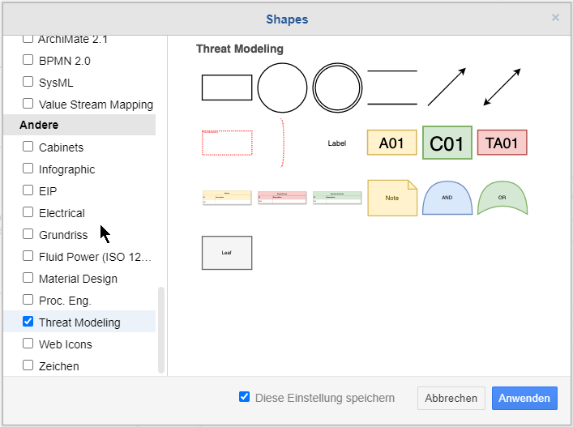

# SCRATCh IoT Threat Modeling Templates

This is a collection of templates in [Draw.IO](https://app.diagrams.net/) format for Threat Modeling of various IoT architectures.

Templates for the following architectures are available:

|Template|
|---|
|[Typical IoT Architecture](./examples/iot_example_edge-computing.drawio)|
|[Typical IoT Architecture with Edge Computing](./examples/iot_example_generic.drawio)|
|[Typical LoRaWAN Architecture](./examples/iot_example_lorawan.drawio)|

### How To Use

You can take the above templates as a starting point to develop your own threat model.

The provided Excel-spreadsheet contains example Threats that can kick off your threat modeling session.

### Adding Threat Modeling Shapes to Draw.IO 

Threat Modeling shapes can be added to draw.io by clicking on `Add Shapes` and selecting `Threat Modeling`

